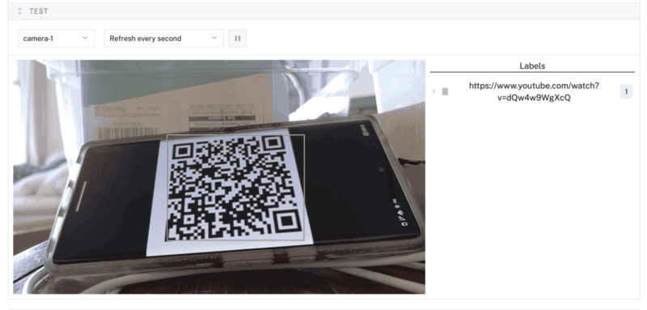
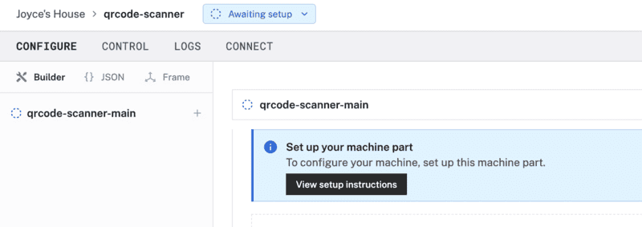
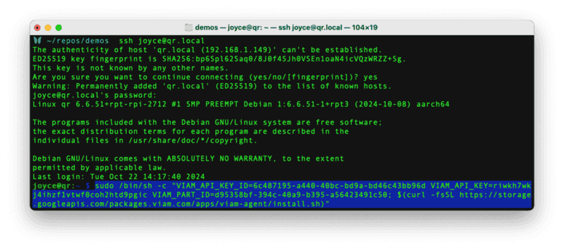
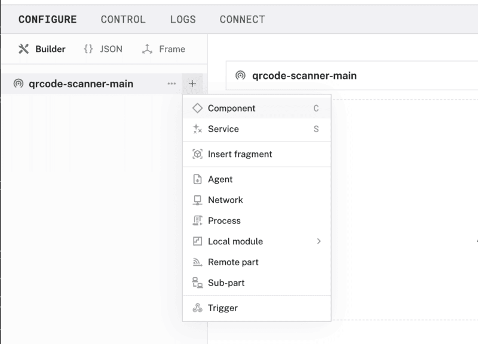
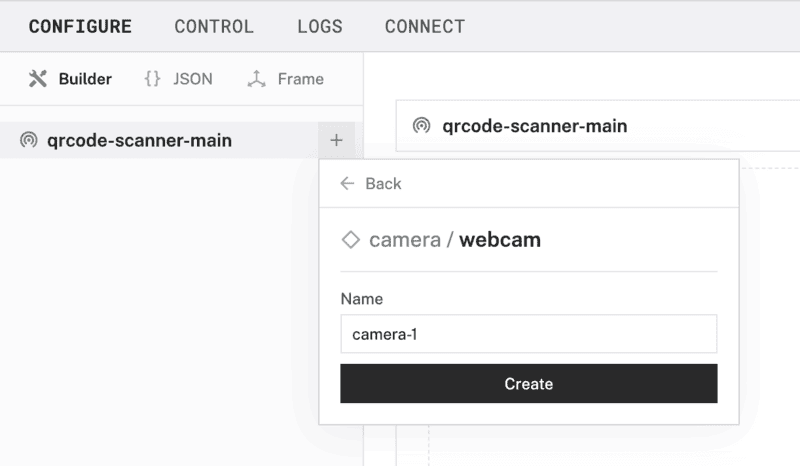
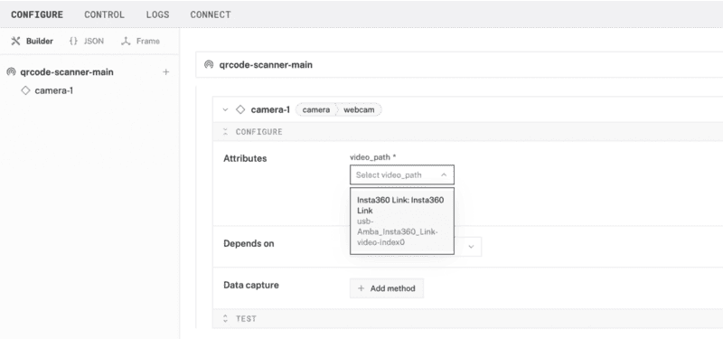
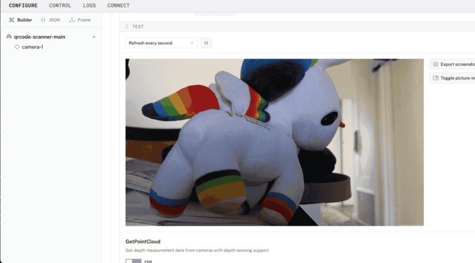
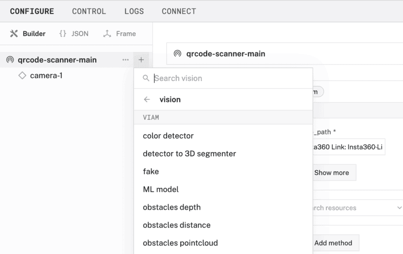
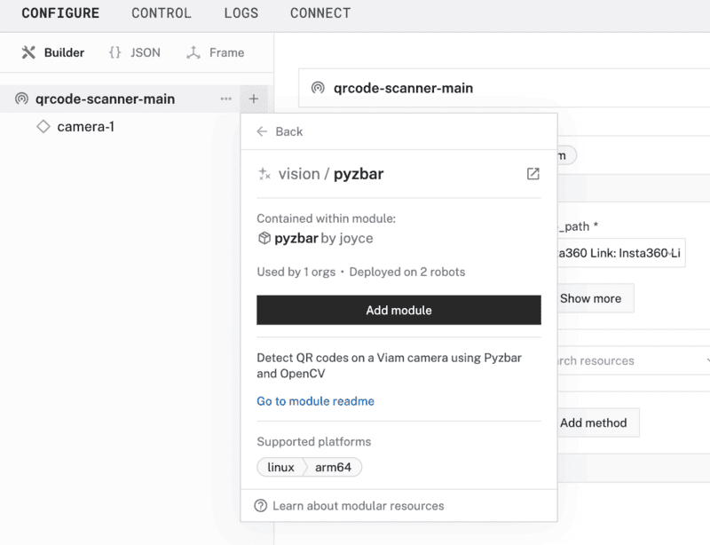
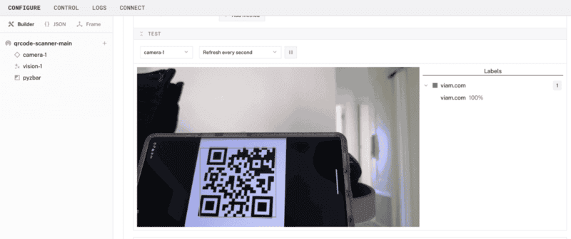

author: Joyce
id: qrcode
summary: Detect QR codes on a camera using Pyzbar and OpenCV
categories: Getting-Started, Developer
environments: web
status: Published
feedback link: https://github.com/viam-labs/viamcodelabs/issues
tags: Getting Started, Developer

# Use a QR code scanner

<!-- ------------------------ -->

## Overview

Duration: 2

QR codes can encode a wide variety of information, including website URLs, contact details, or text and binary data.

In this codelab, you'll learn how to use a QR code scanner to detect and decode QR codes using a Viam module. We'll leverage the [`pyzbar`](https://pypi.org/project/pyzbar/) and [OpenCV](https://pypi.org/project/opencv-python/) Python libraries to process images from a camera and extract information encoded in QR codes. By the end, you'll have a working solution that can identify QR codes in real-time and trigger relevant actions.

### What You’ll Build

- A camera that can detect and decode QR codes

### Prerequisites

- A computer with MacOS, Windows, or Linux to flash your Raspberry Pi and configure the device's components using the Viam app
- Hardware and supplies requirements

  - 1 - [Raspberry Pi 5](https://www.amazon.com/Raspberry-Single-2-4GHz-Quad-core-Cortex-A76/dp/B0CLV7DFD2)
    - Follow the [Raspberry Pi setup guide](https://docs.viam.com/installation/prepare/rpi-setup/) to make sure your Pi is flashed with a Viam-compatible operating system, and that you are able to SSH into it.
  - 1 - microSD card to use with your Pi
  - 1 - power supply for your Pi
  - 1 - USB web camera

### What You’ll Need

- All the hardware components listed in prerequisites.
- Sign up for a free Viam account, and then [sign in](https://app.viam.com/fleet/dashboard) to the Viam app

### What You’ll Learn

- How to use a webcam to scan and detect QR codes
- How to configure and test a device's components using Viam
- How to use a vision service in Viam

### Watch the Video

Follow along with the step-by-step video.

<!-- ------------------------ -->

## Configure your machine and peripherals

Duration: 3

### Configure your machine

1. In [the Viam app](https://app.viam.com/fleet/dashboard) under the **LOCATIONS** tab, create a machine by typing in a name and clicking **Add machine**.
   
1. Click **View setup instructions**.
   
1. To install `viam-server` on the Raspberry Pi device that you want to use to communicate with and control your webcam, select the `Linux / Aarch64` platform for the Raspberry Pi, and leave your installation method as [`viam-agent`](https://docs.viam.com/how-tos/provision-setup/#install-viam-agent).
   
1. Use the `viam-agent` to download and install `viam-server` on your Raspberry Pi. Follow the instructions to run the command provided in the setup instructions from the SSH prompt of your Raspberry Pi.
   
1. The setup page will indicate when the machine is successfully connected.
   

### Add your USB webcam

1. Connect the USB webcam to the Raspberry Pi.
1. In [the Viam app](https://app.viam.com/robots), find the **CONFIGURE** tab. It's time to configure your hardware.
1. Click the **+** icon in the left-hand menu and select **Component**.
   
1. Select `camera`, and find the `webcam` module. This adds the module for working with a USB webcam. Leave the default name `camera-1` for now.
   
1. Notice adding this component adds the webcam hardware component called `camera-1`. The collapsible panel on the right corresponds to the part listed in the left sidebar. From the **Attributes** section of the panel, select a `video_path`.
   
1. Click **Save** in the top right to save and apply your configuration changes.
1. At the bottom of the `camera-1` panel, expand the **TEST** section to ensure you have configured the camera properly.
   
   > aside negative
   > If any problems occur, check under the **LOGS** tab to see what might be going wrong. [Refer to the troubleshooting guide if needed.](https://docs.viam.com/components/camera/webcam/#troubleshooting)

<!-- ------------------------ -->

## Add a vision service

Duration: 3

Now that your hardware is working the way you want it, it's time to add a vision service to detect and decode a QR code.

1. In the Viam app, click the **+** icon in the left-hand menu and select **Service**, and then `vision`.
   
1. Search for a module called `pyzbar`. Then click **Add module**, and **Create** a new vision service called `vision-1`.
   
1. Notice this creates two new items in the left sidebar. The first is your new vision service called `vision-1`, and the second is your new `pyzbar` module.
1. In the `vision-1` panel under the **Depends on** section, check the `camera-1` resource. This configures the vision service to depend on data coming in from the webcam.
1. **Save** your changes in the top right and wait a few moments for the configuration changes to take effect.
1. At the bottom of the `vision-1` panel, expand the **TEST** section to ensure you have configured the vision service properly. Point the webcam towards a QR code to see if the camera detects it.
1. If the scanner detects a QR code, a bounding box will highlight the QR code in the video feed, decode the data, and display it on the right under **Labels**. In the example shown here, the URL decoded was `viam.com`.
   

   > aside negative
   > **Troubleshooting:**
   >
   > - Check under the **LOGS** tab of the Viam app to see what might be going wrong.
   > - Make sure you are testing with a valid QR code. You can generate QR codes [here](https://qrnobs.com/).
   > - Make sure you are using a high-quality USB webcam to ensure accurate QR code detection

<!-- ------------------------ -->

## Next Steps

Duration: 3

Now that you have a camera that detects and decodes QR codes, you can do the following:

- [train and deploy a custom vision model](https://docs.viam.com/how-tos/train-deploy-ml/) to detect and classify other items besides QR codes
- extend the [pyzbar module](https://app.viam.com/module/joyce/pyzbar) in the Viam registry to add custom functionality or trigger specific actions
- [add more components and services](https://docs.viam.com/platform/#the-things-that-make-up-a-machine) to enhance the functionality of your machine

### Additional Viam resources

- [Viam documentation](https://docs.viam.com/)
- [Viam how-to guides](https://docs.viam.com/how-tos/)
- [Viam Discord community](http://discord.gg/viam)
